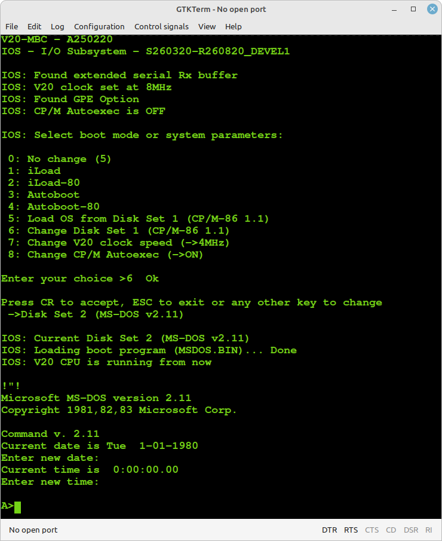

# MS-DOS v2.11 support (experimental) for the V20-MBC

Thanks to **Kevin Price** now MS-DOS 2.11 is running on the V20-MBC!

See: https://github.com/keyvin/v20mbc-msdos

In this folder there are the current files to try the MS-DOS v2.11 porting by Kevin on the V20-MBC.

### HOW TO DO: 

**1:** Upload the IOS on the Atmega32 with this one: **S260320-R260820_DEVEL1** (on the parent folder);

**2:** Copy **DS2N00.DSK**, **MSDOS.BIN** and **DS2NAM.DAT** (from here) on the root of your SD, then reboot the V20-MBC changing the current Disk Set to MS-DOS with the usual way (RESET + USER buttons pressed).

**This only works if you have already uploded the S260320-R260820_DEVEL1 IOS on the Atmega32!**

### Note 1: 
The DS2N00.DSK and MSDOS.BIN files are just the current DS0N00.DSK and AUTOBOOT.BIN renamed files taken from https://github.com/keyvin/v20mbc-msdos. The DS2NAM.DAT file is just needed to correctly display the OS name when changing the Disk Set in the Sytem Boot menu of the V20-MBC

### Note 2: 
I've uploaded here also the binary file **S260320-R260820_DEVEL1.ino.with_bootloader_atmega32_16000000L.hex** ready to be flashed on the Atmega32 (Fuse bits: High Byte 0xD6, Low Byte 0xAF, Lock Byte 0xCF)
